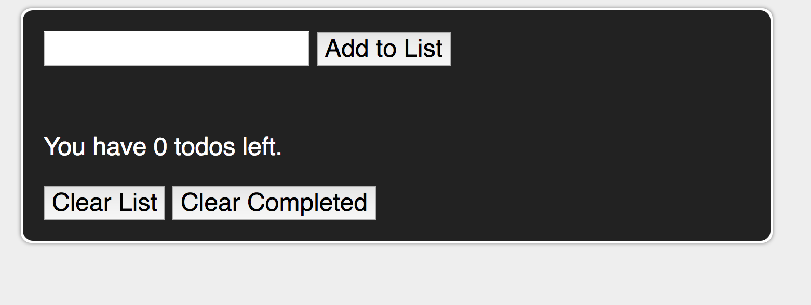
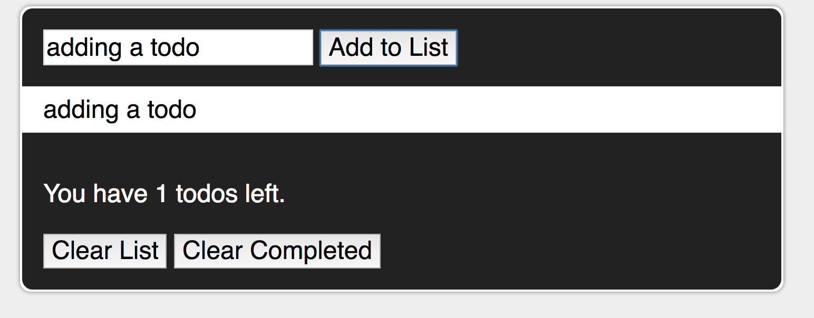
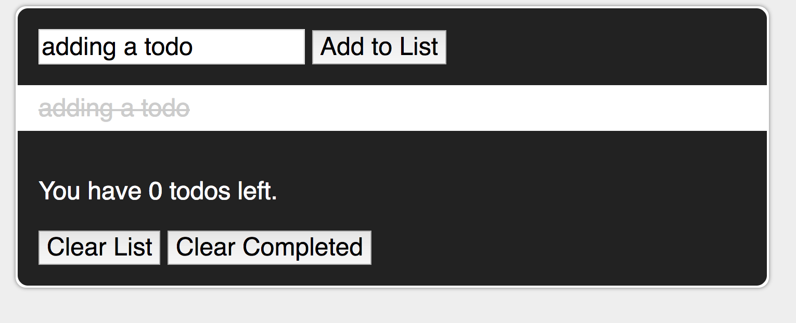

We are gonna be making a todo list! YAY!!

All of the HTML and CSS has been written for you. All you have to do is write the javascript to handle the following things.

Make sure you **read the HTML** before you start!!!!

## Pseudocode
 
1.	When the user submits their to-do list item
	*	Select the input field the user has typed their to-do list info into
	*	Get the value of the input field
	*	Create a list item
	*	Place the text inside of the list item
	*	Append the list item to our ordered to-do list

2.	When the user clicks remove next to a to do list item
	*	Select the to-do list item the user wants to remove
	*	Delete the selected item from the page
	
3.
	*	When the user clicks on the list item
	*	Get the to-do list item the user clicked on
	*	Add a css line-through style to the item
 
4.	When the user clicks the Clear List button
	*	Select the list
	*	Empty the list

5.	Select the to-do list counter element
	*	Set the text inside the to-do list counter element to the number of items in the to-do list

## Screenshots

1. Before we add a todo

2. Adding a todo

3. Completing a todo

